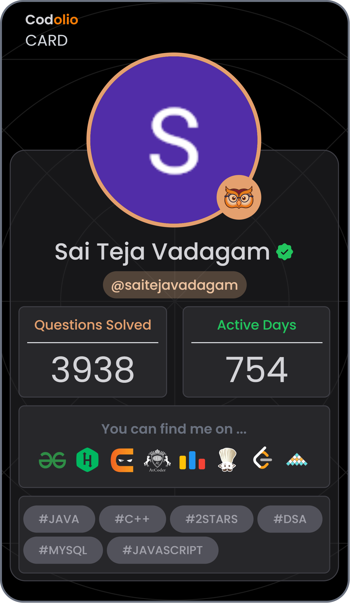

<h1 align="center">Hi, I'm Sai Teja Vadagam 👋</h1>

  <b>Full Stack Developer · React · Spring Boot · Java</b> 
  Building scalable web apps and clean backend systems · Open to full-time opportunities

  
  
  

---

## 🙋‍♂️ About Me

- 🔭 Currently building **ShopEase** — a full-stack ecommerce app with React + Spring Boot
- 📚 Learning **TypeScript**, **Next.js**, and **System Design**
- 💼 Actively looking for **full-time Full Stack / Java Backend roles**
- 🌍 Based in **Hyderabad, India**
- ⚡ Fun fact: I animate UIs with GSAP just for the joy of it

---

## 🛠️ Tech Stack

**Frontend**

**Backend**

**Tools & Platforms**

---

## 🚀 Featured Projects

| Project | Description | Tech | Live |
|--------|-------------|------|------|
| **ShopEase** | Full-stack ecommerce app with cart, auth & product management | React, Spring Boot, Java | [🔗 Live](https://shopease-react.vercel.app) |
| **React GSAP Website** | Animated frontend experience with smooth scroll & transitions | React, GSAP | — |
| **Weather App** | Live weather dashboard with real-time API data | React, OpenWeather API | [🔗 Live](https://weather-orcin-gamma.vercel.app/) |

---

## 🧩 LeetCode Stats

  

---

## 📊 Codolio Stats

  

---

  <i>💼 Open to full-time roles in Full Stack or Java Backend development. Let's connect!</i>

